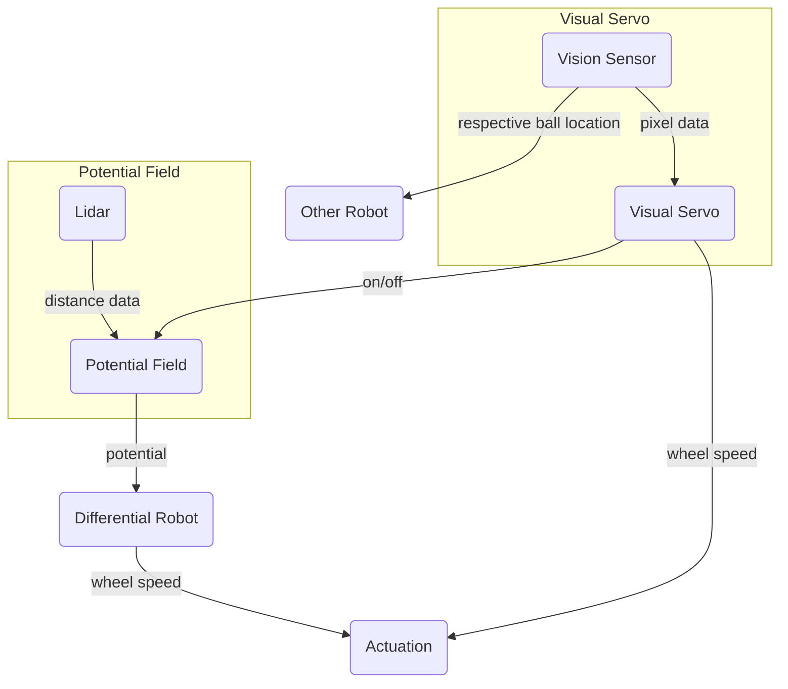
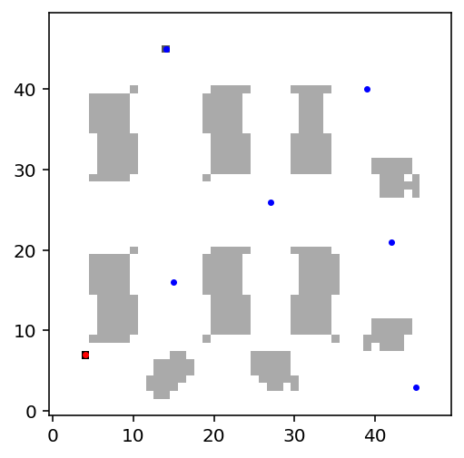
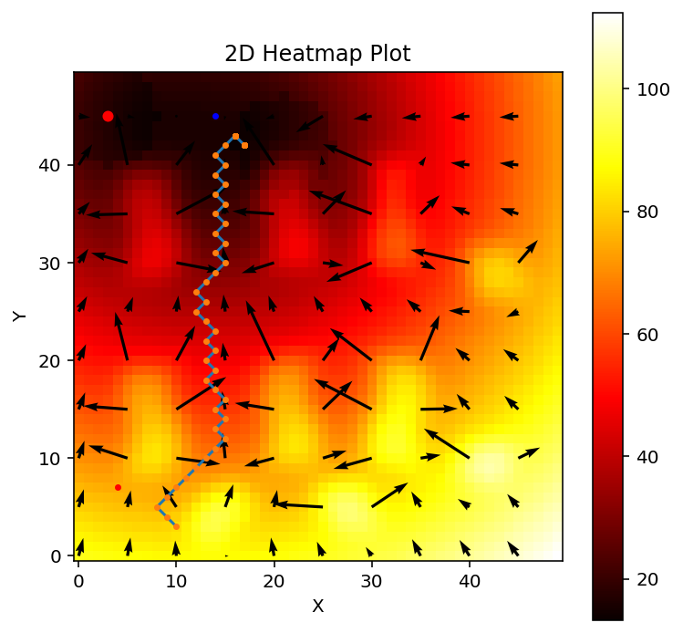
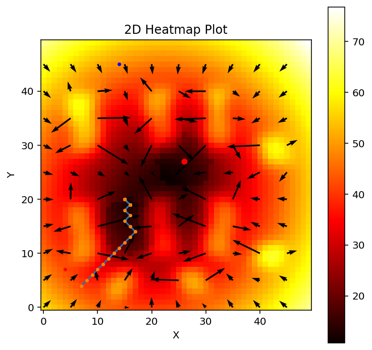
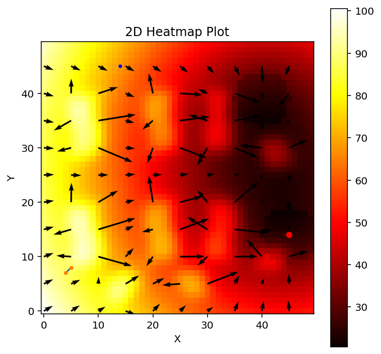

# Multi-agent Differential Robot Path Planning with Visual Servoing
<ins>Team Members</ins>  
Temple Shema - Potential Field, Robot Communication, Performance Measurement, GitHub       
Kartik Doddikindi - Visual Servo, Measurement Modeling, Project Integration, Github  
Jinsol Kang - Visual Servo, Collision Modeling, Project Integration, Github  
Moses Muamba - Potential Field, Github

## Introduction
ECSE 275 introduced a variety of concepts covering a wide range of applications. Among these, what intrigued our group the most was the study of differential robots and their path planning. Mobile robots have numerous applications, particularly in autonomously planning their journeys to reach a destination. This motivated us to delve deeper and explore how we could expand on these ideas.

As a result, we decided to implement multiple differential robots operating simultaneously. Additionally, we integrated visual servoing into the path-planning process, enabling the robots to perform more complex tasks, such as identifying secondary goal points that are unknown at the start of their journey.  

By combining these steps, we aimed to create a system of three differential robots capable of navigating toward their primary goals, discovering unknown secondary goal points using visual servoing, and avoiding collisions with obstacles and each other. Each robot would be given a color, red, green, and blue, so they can find their respective secondary goals that are red, green, or blue.

## Approach
### Differential Robot  
A differential robot is a mobile robot that navigates using two independently driven wheels mounted on a common axis. These wheels rotate at different speeds to control the robot's movement.

  

For this project, we began by utilizing the differential robot model previously used in a homework assignment on mobile robots. To get the robot moving, we applied inverse kinematics to calculate the joint actuation of each wheel. The code from the homework assignment was appropriate for this project, as it effectively computes joint speeds from potential fields.

$$
\begin{bmatrix}
\omega_R \\\
\omega_L
\end{bmatrix} =
\frac{1}{r} \begin{bmatrix} C_\theta - \frac{w}{2a} S_\theta & S_\theta + \frac{w}{2a} C_\theta \\\ C_\theta + \frac{w}{2a} S_\theta & S_\theta - \frac{w}{2a} C_\theta \end{bmatrix} \begin{bmatrix} \dot{x}_a \\\ \dot{y}_a \end{bmatrix}
$$
where 
$$
\begin{bmatrix} \dot{x}_a \\\ \dot{y}_a \end{bmatrix} =
\begin{bmatrix} x_d - x_a \\\ y_d - y_a \end{bmatrix}
$$

The concepts learned in ECSE 275 facilitated the implementation of the differential robot, providing a strong foundation for incorporating additional concepts applied to the robot.

---
### Visual Servo 
To implement visual servoing, we equipped the mobile robot with a vision sensor capable of depth perception up to 3 meters. We determined that 3 meters was an acceptable range because it allowed the robot to detect secondary goals without requiring excessive processing time to calculate their positions. 

  

To simulate the secondary goals assigned to the robots, we created colored spheres that the vision sensor could recognize. These spheres served as visual targets for the robots to identify and navigate toward.

*Version 1*  
We needed to develop a method for the robot to center itself on its target (ball) when it detected its respective colored ball. The initial version of the visual servo system used proportional control. Based on a predefined RGB threshold, the system scanned every pixel in the vision sensor's field of view and calculated the average position of the pixels that matched the color threshold. Using this average position, it determined the offset from the center of the vision sensor, providing an x-coordinate offset in pixels. With this value and a proportional gain factor (*kₚ*), we implemented proportional control to enable the robot to rotate toward the target.

  

<ins>Limitation<ins/>
- Multiple balls could not be tracked because the system averaged their positions, leading to inaccurate results

  

- X-coordinate offset alone could not guid the robot to move towards the goal

  

*Version 2*  
Upon further inspection, we discovered a more effective function within the vision sensor: `simVision.blobDetectionOnWorkImg`. This function groups pixels that form an image of a ball into "blobs," allowing manipulation of each blob individually. Additionally, the vision sensor includes a depth sensor, enabling the detection of the distance between the camera and the balls.

Using these capabilities, we programmed the mobile robot to identify the balls, select the closest one using the depth sensor, and calculate the normalized depth. This depth value was then used in a proportional control system to regulate the robot’s forward speed. As a result, the robot could identify the nearest secondary goal and move toward it. 

  

---
### Potential Field  
To control the mobile robot, we used a potential field approach, where obstacles and the robot exert a repulsive force, while the goal exerts an attractive force. The differential robot follows the resultant potential field at each point, guiding it toward its respective goal. This method also makes path planning reactive, allowing obstacles and goal points to change in real time.

At regular intervals, we calculate the total potential field by summing all the repulsive and attractive forces using the following equations:

$$
\vec{F} = \vec{F,att} +  \sum_{i=1}^{n_{obs}} \vec{F}_{rep,i}
$$

Using the LiDAR sensor to measure distances, we calculate the repulsive force from obstacles using this formula:

$$
\nabla U(\vec{p}) = \begin{cases} \frac{-c_1 (\vec{p} - \vec{p,Obs})}{|\vec{p} - \vec{p,Obs}|^3} & d_{min} \leq |\vec{p} - \vec{p,Obs}| \leq d_{max} \\\ 0 & \text{otherwise} \end{cases}
$$

Similarly, the attractive force exerted by the goal is determined using this formula:

$$
\nabla U(\vec{p}) = \begin{cases} k_1 (\vec{p} - \vec{p,goal}) & |\vec{p,goal} - \vec{p}| < d \\\ \frac{d k_1 (\vec{p} - \vec{p,goal})}{|\vec{p} - \vec{p,goal}|} & |\vec{p,goal} - \vec{p}| \geq d \end{cases}
$$

Implementing the potential field was feasible because we gained a solid understanding of it in ECSE 275. This foundation enabled us to implement additional repulsive functions, such as robot-to-robot repulsion and conflict resolution, with greater confidence.

<ins>Robot Collision Avoidance</ins>
- *Robot-Robot Repulsion*
We added a function to increase the robots’ repulsive force when they are in close proximity to each other. This adjustment ensures that collisions are avoided, as the obstacle's repulsive force alone might otherwise push the robots toward one another. 

  

As shown, when two mobile robots are placed between obstacles, they successfully maneuver around each other, as their mutual repulsive force becomes stronger than the obstacle's repulsive force.
 
- *Conflict resolution*
There was a situation where robot-robot repulsion had a difficult time driving the robot to its destination. When robots come in a perpendicular path, and there were obstacles around the four corners they come from, they would collide.
    Hence we added a function that prioritizes one robot (hard coded) so that the least priority robot slows down so that the priority robot can pass. This is done by lowering the potential field by a factor we can choose.

		def resolve_conflicts(robot_name, dU, priority_dict, shared_positions, conflict_dist=1.0):
	 		current_position = shared_positions[robot_name]
	 		for other_robot_name, other_position in shared_positions.items():
	 			if other_robot_name != robot_name:
	 				distance = np.linalg.norm(current_position - other_position)
  					if distance < conflict_dist and priority_dict[other_robot_name] > priority_dict[robot_name]:
  						dU *= 0.5  

  		return dU

  <table>
    <tr>
      <td align="center">
        
         
        <b>Collision</b>
      </td>
      <td align="center">
        
         
        <b>Resolve</b>
      </td>
    </tr>
  </table>

Having both the robot-robot repulsion and conflict resolution made it so that collision occurred way less then just using potential fields.

---
### Flow Chart  

As shown in the flowchart, both the LiDAR sensor and the vision sensor are continuously active. The LiDAR sensor provides distance measurements for the potential field, while the vision sensor supplies pixel data for the visual servoing.

If no ball is detected by the vision sensor, the potential field takes the distance data from the LiDAR sensor to calculate the total potential that the robot experiences. The differential robot then uses this value to determine the wheel speeds through inverse kinematics. To ensure a smooth transition between different potential field states, a smoothing function is applied, with `alpha` being increment factor, to prevent jerky movements.

	smoothed_dU = alpha * previous_dU[robot_name] + (1 - alpha) * current_dU
 	previous_dU[robot_name] = smoothed_dU

If a ball is detected by the visual servoing system, it overrides the potential field input and directly provides wheel speed commands to the actuators using the proportional control method described earlier. A smoothing factor is also applied here to ensure that switching from potential field control to visual servoing occurs without sudden jerks.

	local blended_leftSpeed = (1 - alpha) * pf_leftSpeed + alpha * (vs_leftSpeed or 0)
 	local blended_rightSpeed = (1 - alpha) * pf_rightSpeed + alpha * (vs_rightSpeed or 0)
    
	local smoothing_factor = 0.3 -- Adjust this for desired smoothness
	smoothed_leftSpeed = (1 - smoothing_factor) * (smoothed_leftSpeed or 0) + smoothing_factor * blended_leftSpeed
	smoothed_rightSpeed = (1 - smoothing_factor) * (smoothed_rightSpeed or 0) + smoothing_factor * blended_rightSpeed
--- 
 
### Robot Communication
- The Purpose of Robot-Robot Communication: The robot-robot communication mechanism enhances collaboration among robots by sharing information about detected blobs. This approach ensures that robots can leverage each other's detection capabilities to identify and navigate toward targets more efficiently, even when a robot itself cannot directly detect a blob. This collaborative strategy is particularly beneficial in complex environments where individual robots may have limited detection ranges or obstructions in their paths. As the system size increases, robot communication ensures scalability by distributing the workload and reducing redundant efforts, ultimately leading to faster and more effective goal completion.
- Basic Implementation: Each Robot has 2 initial main goals(Primary goals that are predefined), The Visual Servo Detects other non-target blobs(Blobs with a different color than the assigned robot color), and A control Logic assigns them to their respective robot as Secondary goals. They are added after reaching the first goal to allow the robots to travel and identify different features hence increasing the probability of detecting different coloured blobs. The second Primary goal ensures the task assigned to robots ends(Termination Check).
- In the Lua code, each robot calculates the positions of detected blobs (both target and non-target) within its field of view using its vision servo. Detected blobs are categorized based on their colors, with positions converted into global coordinates. The positions and labels of the detected blobs are stored in two data structures: globalBlobData for non-target blobs and targetBlobsData for blobs matching the robot's target color. These data structures are accessible via script functions, allowing other robots to query and retrieve relevant blob information for collaborative decision-making.
- In Python, the communication is facilitated by querying globalBlobData and targetBlobsData from other robots. Each robot processes the retrieved data to identify relevant blobs based on its target color, ensuring no redundant or unnecessary goals are added. Detected target positions are compared against the robot's current goals and target data to avoid duplication. If a relevant blob is found, a temporary dummy object is created at the blob's position, and it is added as a secondary goal to the robot's goal queue. This workflow allows robots to dynamically adapt their goals based on shared information, enabling a cohesive and efficient multi-robot system.

## Performance Measurement

- To measure the performance of the system, We use 2 different metrics(The Success Rate and The Position Accuracy Error). The comparison is done for Non-Communicating System and Communicating System.
- The Success Rate is defined as percentage of Secondary Goals reached with respect to the present secondary goals available.

## Results

#### Key System Features

**Robot Obstacle Avoidance**  
In this demonstration, the robot successfully detects and avoids obstacles in its path using the potential field algorithm. The attractive force pulls the robot toward the goal, while the repulsive forces from obstacles guide it around them. This process ensures collision-free navigation in dynamic environments.

  

**Robot Seeking the Closest Ball**  
In this clip, the robot demonstrates its ability to identify and seek the nearest ball using blob detection. Depth data helps prioritize the closest target, enabling the robot to execute tasks efficiently while avoiding distractions from other objects.

  

**Robot Ball Detection and Goal Navigation**  
Here, the robot detects a target ball using the vision system and successfully navigates toward it using the depth data from the vision sensor. The blending of potential fields and visual servoing allows smooth switching between modes, ensuring the robot tracks the ball efficiently.

  

### Heatmap Visualizations of Potential Fields

To enhance our understanding of the robots' interactions with their environment and validate the simulation setup, we generated heatmaps of the potential fields. These heatmaps depict both the repulsive forces (from obstacles and other robots) and the attractive forces (from goals). By analyzing these heatmaps, we gained insights into how the robots were expected to navigate their environment before running the simulation.

#### Blank Map with Obstacles
The blank map provides a foundation for understanding the robot environment setup, highlighting obstacles and grid boundaries. This visualization ensures that obstacle placements align with the simulation goals.

  

#### Heatmap for Robot 0
Robot 0 is tasked with reaching its assigned goals while avoiding obstacles. The heatmap below shows the combined potential field for Robot 0, including its assigned attractive and repulsive forces.

  

#### Heatmap for Robot 1
Robot 1 navigates its own path toward its respective goals. The heatmap highlights the interplay of repulsive forces (keeping the robot away from obstacles) and attractive forces (guiding it to its goals).

  

#### Heatmap for Robot 2
Robot 2's heatmap showcases its expected path based on the potential fields. This visualization illustrates how Robot 2 is influenced by its goals and obstacles in its path.

  

#### Key Observations
- **Obstacle Avoidance**: The repulsive forces successfully push the robots away from obstacles, ensuring collision-free paths.
- **Goal Attraction**: The attractive forces guide the robots smoothly toward their respective goals.
- **Path Planning**: The combined heatmaps demonstrate how the potential fields work together to dynamically plan paths for each robot.

### Full Implementation Video

We have compiled a comprehensive video showcasing the project’s entire implementation and functionality, uploaded to YouTube. The video demonstrates:
1. **Initial Setup**: Overview of the simulated environment, including robots, obstacles, and goal objects.
2. **Robot Navigation**: Visualizations of obstacle avoidance, target ball detection, and collaborative goal achievement.
3. **Collision Avoidance**: The system incorporates conflict resolution and robot-robot repulsion to prevent collisions, ensuring smooth navigation in multi-robot environments.
4. **Collaborative Robot Communication**: Robots are designed to share information about detected blobs and update their goals dynamically, enhancing task efficiency and adaptability.

  Without Communication

  

  With Communication

  

## Conclusion

This project successfully demonstrated the integration of differential robot path planning with visual servoing in a multi-robot system. Through the combination of potential fields and blob detection, the robots effectively navigated toward their goals while avoiding obstacles and dynamically adapting to new targets. Key achievements include:

1. **Dynamic Path Planning**: The robots navigated their environments autonomously, seamlessly switching between potential field-based obstacle avoidance and visual servoing for target tracking.
2. **Collaborative Features**: Robot communication allowed for efficient sharing of target information, enabling dynamic updates to goals and enhancing overall task efficiency.
3. **Collision Avoidance**: The combination of robot-robot repulsion and conflict resolution mechanisms ensured smooth navigation and minimized collisions in constrained environments.
4. **Smooth Transitions**: Smoothing algorithms ensured that transitions between potential field navigation and visual servoing were free from abrupt, jerky movements.

### Strengths
- **Scalability**: The system is designed to scale with additional robots and goals, as seen in the code's use of communication and dynamic task allocation.
- **Collision Avoidance**: Implementation of robot-robot repulsion and conflict resolution minimized potential deadlocks and ensured efficient navigation in constrained spaces.
- **Robust Target Tracking**: The vision-based system accurately identified and pursued the nearest targets, prioritizing efficient goal completion.

### Challenges and Improvements
- **Communication Issues**: Managing live communication between robots presented challenges. Robots updated their detected balls at every time unit instead of only when a new ball was identified, leading to inefficiencies and confusion among robots. We improved the performance by refining the communication protocol to include rate-limited updates in this case.  
- **Potential Field Tuning**: Fine-tuning the parameters of the potential field was another challenge. Achieving the right balance between attractive and repulsive forces required significant trial and error. Incorrect tuning could result in oscillations, inefficient paths, or even collisions. Using adaptive or self-tuning potential fields could improve the system's robustness.  
- **Lighting and Detection**: Blob detection relied heavily on the simulated environment's lighting conditions. In real-world scenarios, advanced image processing techniques may improve detection reliability.
- **Deadlock Situations**: While conflict resolution addressed most cases, more sophisticated priority algorithms could further reduce rare deadlocks in complex scenarios.

### Future Work
- Develop adaptive potential field algorithms to adjust parameters based on the environment or robot behavior dynamically.
- Integrate advanced vision algorithms, such as neural networks, to improve blob detection and classification in varying conditions.
- Expand the system to handle uneven terrains or dynamic obstacles in real-world applications.
- Optimize communication protocols for large-scale multi-robot systems to reduce latency and improve data-sharing efficiency.

In summary, the project met its primary goals, laying a solid foundation for further exploration and improvement in collaborative multi-robot systems by successfully demonstrating the feasibility and effectiveness of multi-agent robotic systems operating in dynamic environments. The integration of visual servoing, potential field navigation, and real-time collision avoidance enabled these robots to dynamically adjust their paths and achieve their goals, even in the presence of obstacles and changing conditions. 

The practical applications of this system extend to scenarios requiring adaptability and precision. For example, it could transform operations in chaotic warehouses where paths to items are constantly obstructed by moving people, equipment, and inventory. The ability to react dynamically to these changes while maintaining a focus on predefined goals can significantly enhance efficiency and safety. Similarly, this technology has potential in rescue operations, where pre-planned routes are often infeasible, and rapid reactivity to new obstacles and conditions is critical to success. 

These implementations highlight the project’s versatility and the broader impact autonomous systems can have across industries. By addressing challenges inherent in unstructured and unpredictable environments, this work underscores the value of multi-agent robotics in advancing automation and assisting with critical tasks in real-world applications.

