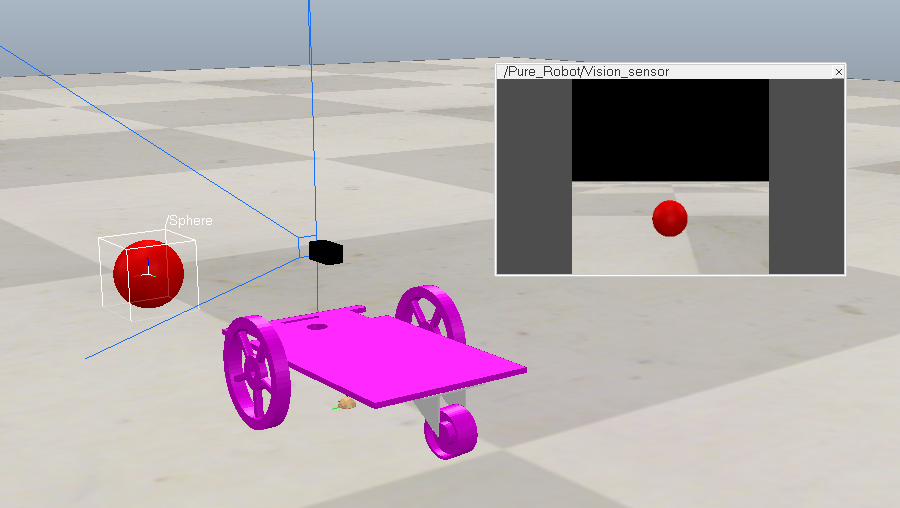
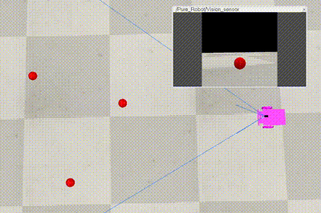
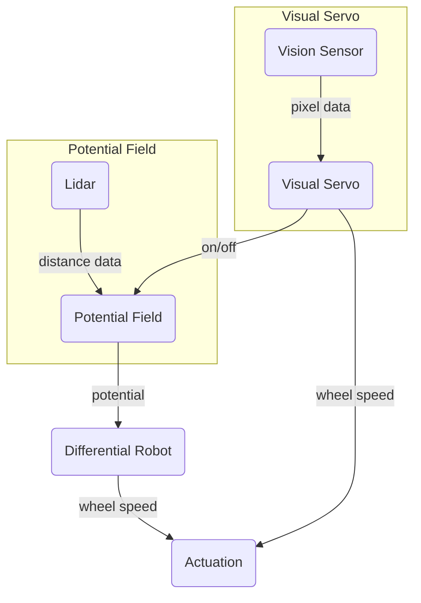

# Multi-agent Differential Robot Path Planning with Visual Servoing
<ins>Team Members</ins>  
Temple Shema -   
Kartik Doddikindi -   
Jinsol Kang - Visual Servo, Collision Modeling, Github 
Moses Muamba -   

## Introduction
ECSE 275 introduced a variety of concepts covering a wide range of applications. Among these, what intrigued our group the most was the study of differential robots and their path planning. Mobile robots have numerous applications, particularly in autonomously planning their journeys to reach a destination. This motivated us to delve deeper and explore how we could expand on these ideas.  
As a result, we decided to implement multiple differential robots operating simultaneously. Additionally, we integrated visual servoing into the path-planning process, enabling the robots to perform more complex tasks, such as identifying secondary goal points that are unknown at the start of their journey.  
By combining these steps, we aimed to create a system of three differential robots capable of navigating toward their primary goals, discovering unknown secondary goal points using visual servoing, and avoiding collisions with obstacles and each other. Each robot would be given a color, red, green, and blue, so they can find their respective secondary goals that are red, green, or blue.

## Approach
### Differential Robot  
A differential robot is a mobile robot that navigates using two independently driven wheels mounted on a common axis. These wheels rotate at different speeds to control the robot's movement.

  

For this project, we began by utilizing the differential robot model previously used in a homework assignment on mobile robots. To get the robot moving, we applied inverse kinematics to calculate the joint actuation of each wheel. The code from the homework assignment was appropriate for this project, as it effectively computes joint speeds from potential fields.

$$
\begin{bmatrix}
\omega_R \\\
\omega_L
\end{bmatrix} =
\frac{1}{r} \begin{bmatrix} C_\theta - \frac{w}{2a} S_\theta & S_\theta + \frac{w}{2a} C_\theta \\\ C_\theta + \frac{w}{2a} S_\theta & S_\theta - \frac{w}{2a} C_\theta \end{bmatrix} \begin{bmatrix} \dot{x}_a \\\ \dot{y}_a \end{bmatrix}
$$
where 
$$
\begin{bmatrix} \dot{x}_a \\\ \dot{y}_a \end{bmatrix} =
\begin{bmatrix} x_d - x_a \\\ y_d - y_a \end{bmatrix}
$$

The concepts learned in ECSE 275 facilitated the implementation of the differential robot, providing a strong foundation for incorporating additional concepts applied to the robot.

---
### Visual Servo 
To implement visual servoing, we equipped the mobile robot with a vision sensor capable of depth perception up to 3 meters. We determined that 3 meters was an acceptable range because it allowed the robot to detect secondary goals without requiring excessive processing time to calculate their positions. 

  

To simulate the secondary goals assigned to the robots, we created colored spheres that the vision sensor could recognize. These spheres served as visual targets for the robots to identify and navigate toward.

*Version 1*  
We needed to develop a method for the robot to center itself on its target (ball) when it detected its respective colored ball. The initial version of the visual servo system used proportional control. Based on a predefined RGB threshold, the system scanned every pixel in the vision sensor's field of view and calculated the average position of the pixels that matched the color threshold. Using this average position, it determined the offset from the center of the vision sensor, providing an x-coordinate offset in pixels. With this value and a proportional gain factor (*kₚ*), we implemented proportional control to enable the robot to rotate toward the target.

  

<ins>Limitation<ins/>
- Multiple balls could not be tracked because the system averaged their positions, leading to inaccurate results

  

- X-coordinate offset alone could not guid the robot to move towards the goal

  

*Version 2*  
Upon further inspection, we discovered a more effective function within the vision sensor: `simVision.blobDetectionOnWorkImg`. This function groups pixels that form an image of a ball into "blobs," allowing manipulation of each blob individually. Additionally, the vision sensor includes a depth sensor, enabling the detection of the distance between the camera and the balls.

Using these capabilities, we programmed the mobile robot to identify the balls, select the closest one using the depth sensor, and calculate the normalized depth. This depth value was then used in a proportional control system to regulate the robot’s forward speed. As a result, the robot could identify the nearest secondary goal and move toward it. 

  

---
### Potential Field  
To control the mobile robot, we used a potential field approach, where obstacles and the robot exert a repulsive force, while the goal exerts an attractive force. The differential robot follows the resultant potential field at each point, guiding it toward its respective goal. This method also makes path planning reactive, allowing obstacles and goal points to change in real time.

At regular intervals, we calculate the total potential field by summing all the repulsive and attractive forces using the following equations:

$$
\vec{F} = \vec{F}_{att} + \sum_{i=1}^{n_{obs}} \vec{F}_{rep,i}
$$

Using the LiDAR sensor to measure distances, we calculate the repulsive force from obstacles using this formula:

_(Include the formula for repulsive force here.)_ 

Similarly, the attractive force exerted by the goal is determined using this formula:

_(Include the formula for attractive force here.)_

Implementing the potential field was feasible because we gained a solid understanding of it in ECSE 275. This foundation enabled us to implement additional repulsive functions, such as robot-to-robot repulsion and conflict resolution, with greater confidence.

<ins>Robot Collision Avoidance</ins>
- *Robot-Robot Repulsion*
We added a function to increase the robots’ repulsive force when they are in close proximity to each other. This adjustment ensures that collisions are avoided, as the obstacle's repulsive force alone might otherwise push the robots toward one another. 

  

As shown, when two mobile robots are placed between obstacles, they successfully maneuver around each other, as their mutual repulsive force becomes stronger than the obstacle's repulsive force.
 
- *Conflict resolution*
There was a situation where robot-robot repulsion had a difficult time driving the robot to its destination. When robots come in a perpendicular path, and there were obstacles around the four corners they come from, they would collide.
    Hence we added a function that prioritizes one robot (hard coded) so that the least priority robot slows down so that the priority robot can pass. This is done by lowering the potential field by a factor we can choose.

		def resolve_conflicts(robot_name, dU, priority_dict, shared_positions, conflict_dist=1.0):
	 		current_position = shared_positions[robot_name]
	 		for other_robot_name, other_position in shared_positions.items():
	 			if other_robot_name != robot_name:
	 				distance = np.linalg.norm(current_position - other_position)
  					if distance < conflict_dist and priority_dict[other_robot_name] > priority_dict[robot_name]:
  						dU *= 0.5  

  		return dU

  <table>
    <tr>
      <td align="center">
        
         
        <b>Collision</b>
      </td>
      <td align="center">
        
         
        <b>Resolve</b>
      </td>
    </tr>
  </table>

Having both the robot-robot repulsion and conflict resolution made it so that collision occurred way less then just using potential fields.

---
### Flow Chart  

As shown in the flowchart, both the LiDAR sensor and the vision sensor are continuously active. The LiDAR sensor provides distance measurements for the potential field, while the vision sensor supplies pixel data for the visual servoing.

If no ball is detected by the vision sensor, the potential field takes the distance data from the LiDAR sensor to calculate the total potential that the robot experiences. The differential robot then uses this value to determine the wheel speeds through inverse kinematics. To ensure a smooth transition between different potential field states, a smoothing function is applied, with `alpha` being increment factor, to prevent jerky movements.

	smoothed_dU = alpha * previous_dU[robot_name] + (1 - alpha) * current_dU
 	previous_dU[robot_name] = smoothed_dU

If a ball is detected by the visual servoing system, it overrides the potential field input and directly provides wheel speed commands to the actuators using the proportional control method described earlier. A smoothing factor is also applied here to ensure that switching from potential field control to visual servoing occurs without sudden jerks.

	local blended_leftSpeed = (1 - alpha) * pf_leftSpeed + alpha * (vs_leftSpeed or 0)
 	local blended_rightSpeed = (1 - alpha) * pf_rightSpeed + alpha * (vs_rightSpeed or 0)
    
	local smoothing_factor = 0.3 -- Adjust this for desired smoothness
	smoothed_leftSpeed = (1 - smoothing_factor) * (smoothed_leftSpeed or 0) + smoothing_factor * blended_leftSpeed
	smoothed_rightSpeed = (1 - smoothing_factor) * (smoothed_rightSpeed or 0) + smoothing_factor * blended_rightSpeed

## Results

## Conclusion
